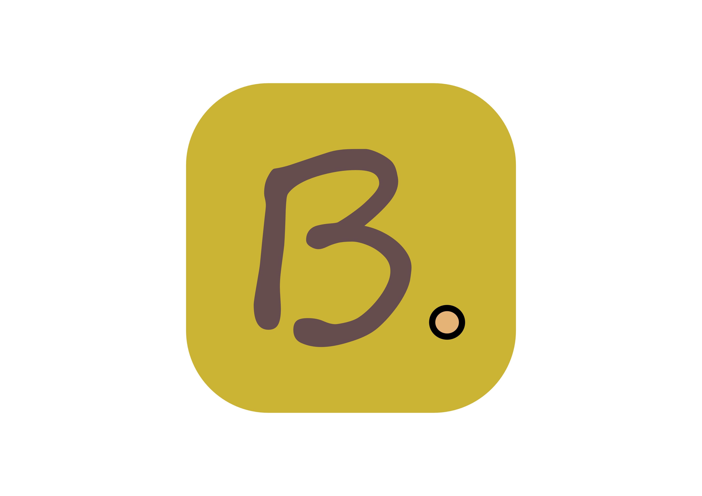

  # Boardly


Boardly is a Java-based collaborative whiteboard project built using a simple client–server architecture. Multiple clients can connect to a single server and draw together on the same canvas in real time.

The project is intentionally kept straightforward. Most of the logic — drawing, syncing points, and handling connections — is written directly without external frameworks, making it easier to follow and modify.

---

## How it works

* One machine runs the server on a port
* Clients connect using the server’s IP and port
* Drawing actions are sent to the server and broadcast to all connected clients

The server handles synchronization, while each client focuses on input and rendering.

---

## Running the project

### Compile

```bash
javac -d out src/Client/*.java src/Server/*.java
```

### Start the server

```bash
java -cp out Server.ServerMain
```

### Configure client IP

Before running the client, open the client-side code and set the server IP address.

The location is marked with a comment in the code:

```java
// replace with server/host IP
```

Use:

* `localhost` if running server and client on the same machine
* The host machine’s local IP if running over LAN

### Start the client

```bash
java -cp "out;lib/*" Client.ClientMain
```

Run multiple clients to test real-time syncing.

---

## Project status

This is an active learning project. The focus is on understanding Java Swing, socket communication, and real-time interaction rather than delivering a finished product.

                                                                                                  — 0t3x


